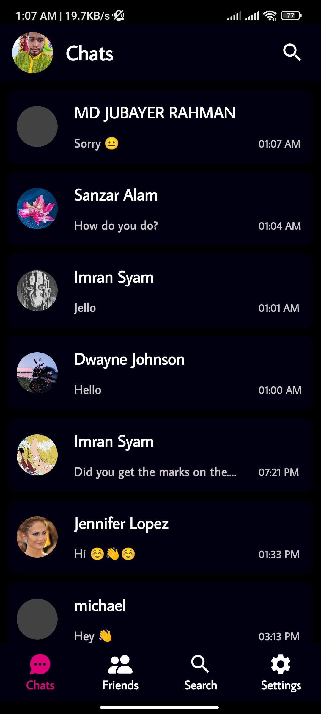
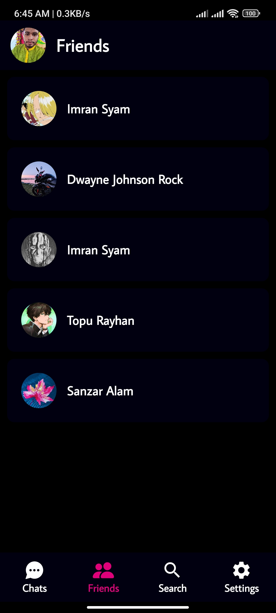

# Chatter

## A chatting app made using Android Studio and Firebase, written in Java.

### Functionalities:
   - Able to login
   - Login verification
   - Signup verification
   - Unique username verification 
   - Able to signup using email (not verified ones)
   - Able to chat
   - Able to send photos
   - Able to add reactions to messages or photos
   - Able to search new users or friends
   - Able to add users as friend (not implemented)
   - Able to update profile picture
   - Able to update name
   - Able to update username
   - Able to update password (not implemented)
   - Able to update email (not implemented)

### Dependencies:
   - Firebase Authentication using custom email
   - Firebase Realtime Database
   - Firebase Storage
   - hdodenhof/CircleImageView
   - pgreze/android-reactions
   - square/picasso

### To use the app download this apk file:

 #### [https://github.com/topurayhan007/Chatter/raw/main/APK/Chatter.apk]
 

